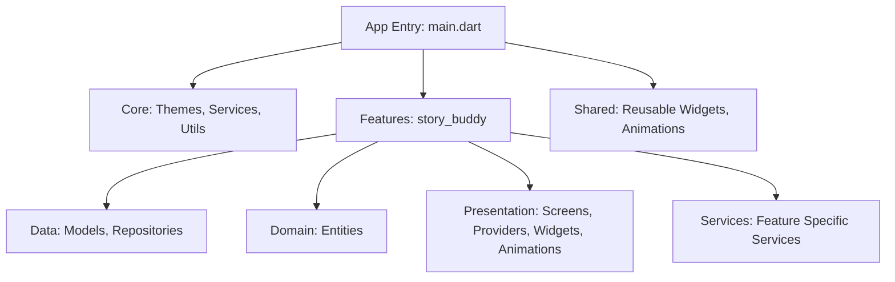
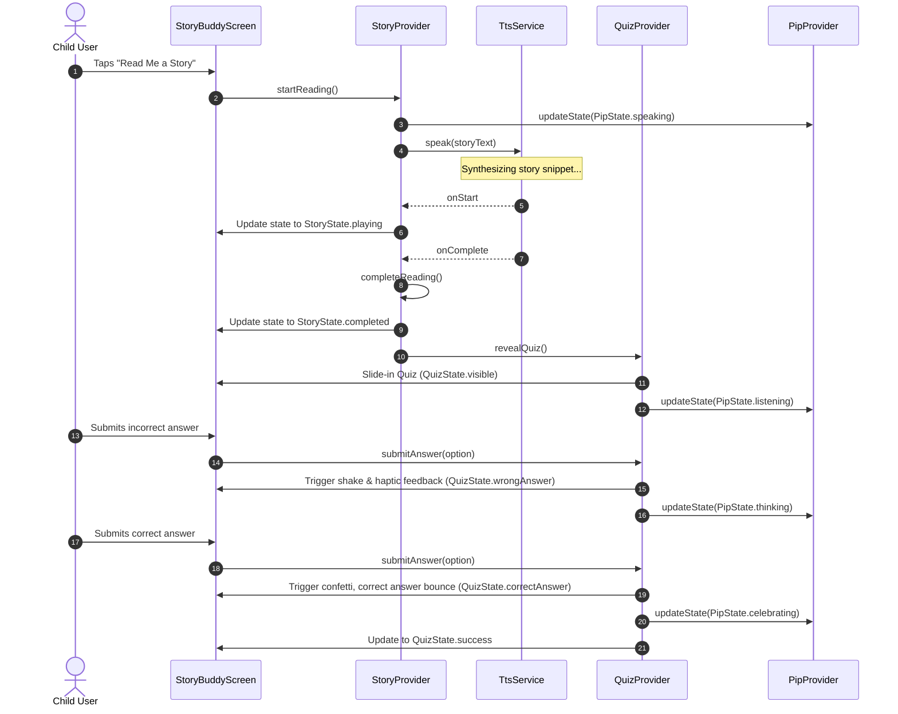

# StoryBuddy - Architecture & Product Implementation Plan

StoryBuddy is a joyful AI-powered storytelling companion for children aged 8–14. The application is designed to feel magical, playful, emotionally engaging, and educational. By introducing **PIP**, an interactive robot companion, we transform passive reading into a dynamic learning journey.

This plan details the technical and design choices required to deliver a production-ready single-screen application in Flutter, using Riverpod for state management, satisfying strict memory and frame-rate guidelines (60fps on 3GB RAM Android devices).

## User Review Required

Please review the following key decisions:
> [!IMPORTANT]
> **State Management Choice**: We are using Riverpod (specifically AsyncNotifier and StateNotifier patterns) to cleanly decouple the audio TTS player states, JSON-based quiz progress, and PIP animation states.
> 
> **Interactive PIP Companion**: PIP will be rendered entirely using high-performance vector/canvas drawings (`CustomPainter` / SVG-like shapes) rather than heavy images. This ensures 60fps animations (gentle breathing, floating, speaking mouth shapes, happy eye movements) with zero memory overhead on low-end Android devices.
> 
> **Data-Driven Quiz Engine**: The quiz renderer will dynamically adapt to any valid JSON payload, accommodating 3, 4, or 5 options, differing question lengths, and displaying a custom Glassmorphic container with micro-animations.

## Open Questions

> [!NOTE]
> 1. **TTS Accent**: We will default to the system's locale accent (e.g. English India `en-IN` or generic English `en-US`), but do you prefer a specific toggle for language accents?
> 2. **Haptic Feedback Intensity**: We will use standard Flutter SDK `HapticFeedback.lightImpact()` and `vibrate()`. Some low-end Android devices have varying vibration engines; we'll handle this gracefully.

---

## Architectural and Product Planning

### 1. Product Analysis
*   **Target Audience**: Children aged 8–14. The UI must be highly intuitive, self-explanatory, and visual.
*   **Core Loop**:
    1.  **Introduce Story**: PIP is idle/breathing. A playful glass card displays the narrative.
    2.  **Narration (TTS)**: Child clicks "Read Me a Story". PIP enters the speaking state. Current text is highlighted or visually cued.
    3.  **Quiz Transition**: As soon as narration finishes, the quiz slides up. PIP enters the listening state.
    4.  **Quiz Interaction**:
        *   *Wrong Answer*: Card shakes. PIP shows an encouraging/thinking state. Child can retry.
        *   *Correct Answer*: Confetti fires. PIP celebrates.
    5.  **Success State**: Story and quiz complete. Option to restart or proceed.
*   **Aesthetics**: Glassmorphism (Violet-themed blur) with vibrant child-friendly accents (Sunshine Yellow for success/celebration, Coral Orange for interactive actions, Sky Blue for secondary items).

### 2. Architecture Decisions
We adopt a **Feature-First Architecture** to ensure clean separation of concerns and scaling capacity.
*   **Core layer**: Hosts app themes, cross-cutting services (like TTS), helper utilities, and abstract animations.
*   **Features layer**: Contains `story_buddy` representing our feature block. This isolates all feature domain logic, data models, repositories, and UI elements.
*   **Shared layer**: Houses components reused across multiple features (e.g. generic GlassCard, custom bounce buttons).



### 3. Folder Structure
The implementation will strictly follow this structure:
```
lib/
├── app/
│   └── app.dart
├── core/
│   ├── constants/
│   │   ├── app_colors.dart
│   │   └── app_strings.dart
│   ├── theme/
│   │   └── app_theme.dart
│   ├── services/
│   │   └── tts_service.dart
│   ├── utils/
│   │   └── logger.dart
│   ├── extensions/
│   │   └── context_extensions.dart
│   └── animations/
│       └── shake_transition.dart
├── features/
│   └── story_buddy/
│       ├── data/
│       │   ├── models/
│       │   │   ├── quiz_model.dart
│       │   │   └── story_model.dart
│       │   └── repositories/
│       │       └── story_repository.dart
│       ├── domain/
│       ├── presentation/
│       │   ├── providers/
│       │   │   ├── pip_provider.dart
│       │   │   ├── quiz_provider.dart
│       │   │   └── story_provider.dart
│       │   ├── screens/
│       │   │   └── story_buddy_screen.dart
│       │   ├── widgets/
│       │   │   ├── glass_card.dart
│       │   │   ├── pip_companion.dart
│       │   │   ├── quiz_renderer.dart
│       │   │   └── story_content.dart
│       │   └── animations/
│       │       └── bounce_animator.dart
│       └── services/
├── shared/
│   ├── widgets/
│   │   └── bubbly_button.dart
│   └── animations/
│       └── fade_in_transition.dart
└── main.dart
```

### 4. State Management Plan
Using Riverpod, we manage states with structured enums and notifier models:

#### State Definitions
*   **StoryState**:
    *   `Initial`: Story text visible; "Read Me a Story" button active.
    *   `Loading`: Fetching/preparing TTS engine.
    *   `Playing`: TTS speaking. PIP is active.
    *   `Completed`: TTS finished. Ready to reveal quiz.
    *   `Error`: TTS initialization or execution failed.
*   **QuizState**:
    *   `Hidden`: Quiz card is off-screen or invisible.
    *   `Visible`: Quiz card revealed; choices active.
    *   `Answering`: Verifying chosen option.
    *   `WrongAnswer`: Chosen option incorrect. Shake feedback.
    *   `CorrectAnswer`: Chosen option correct. Celebrate feedback.
    *   `Success`: Quiz completed; congratulations dashboard.
*   **PipState**:
    *   `Idle`: Gentle breathing, eyes blinking, floating.
    *   `Listening`: Tilt head, blinking, responsive to inputs.
    *   `Speaking`: Mouth shapes animate dynamically to emulate voice.
    *   `Thinking`: Hand-to-chin position, eyes rotating.
    *   `Happy`: Smile, bounce.
    *   `Celebrating`: Spinning, stars/confetti response.

#### Providers
1.  `storyStateProvider`: StateNotifier/Notifier tracking the current `StoryState`.
2.  `quizStateProvider`: Notifier tracking `QuizState`, selected option, and question model metadata.
3.  `pipStateProvider`: Notifier managing PIP's visual expressions (`PipState`), synchronized with Story and Quiz actions.

### 5. Data Flow Diagram



### 6. Widget Tree
```
ProviderScope
 └── StoryBuddyApp
      └── MaterialApp
           └── StoryBuddyScreen
                └── Scaffold (Gradient Background + Parallax)
                     └── Stack
                          ├── BackgroundBubbles (Interactive vector circles)
                          ├── SafeArea
                          │    └── Column (Vertical layout)
                          │         ├── ScreenHeader (ProgressBar / Achievements)
                          │         ├── PipCompanion (Breathing, Floating, Face expression painter)
                          │         └── Expanded
                          │              └── SingleChildScrollView (Responsive content scroll)
                          │                   └── Column
                          │                        ├── GlassCard (Story Content + Narration controls)
                          │                        └── QuizRenderer (Conditional slide-up container)
                          └── ConfettiWidget (Overlay)
```

### 7. Animation System Design
To guarantee 60fps on 3GB RAM devices:
*   **Idle Breathing/Floating**: Linear and Cosine animations driving `Transform.translate` and `Transform.scale` with an infinite repeating controller.
*   **Glass Card Reveal**: `FadeTransition` coupled with `SlideTransition` using custom curve `Curves.easeOutBack` (0.5s duration).
*   **Button Scale**: `AnimatedScale` wrapping interactive buttons, scaling down on tap down (0.95) and bouncing back (1.05) on tap release.
*   **Wrong Answer Shake**: Custom spring physics controller. Animate a horizontal translation offset:
    $$x(t) = A \cdot e^{-\beta t} \cdot \cos(\omega t)$$
*   **Confetti**: Triggered via `ConfettiController` directly bound to the success action.
*   **Repaint Boundaries**: PIP's rendering and Confetti's canvas will run inside their own `RepaintBoundary` nodes to prevent dirtying the root element tree.

### 8. Performance Plan
*   **Const Constancy**: All layout spacing (`SizedBox`), visual static borders, and styling parameters defined as `const`.
*   **Canvas Optimization**: PIP's visual assets are vector shapes drawn using Flutter `CustomPainter` API (efficient path math) rather than loading raster graphics.
*   **TTS Performance**: Initialize TTS engine lazily. Release system audio channels immediately when page is backgrounded/disposed.
*   **Avoid Over-rebuilding**: Make granular widgets (e.g. `SpeakButton`, `OptionButton`) consuming select slices of State Providers (`ref.watch(storyProvider.select(...))`).

### 9. Error Handling Plan
*   **TTS Initialization Fail**: If the device's native TTS engine fails to initialize (e.g., missing languages or hardware limitations), catch the exception, show a comforting diagnostic popup ("PIP is resting his voice! You can read along manually"), and automatically transition to the Quiz state.
*   **JSON Parse Failure**: Build a parsing fallback. If the backend/asset JSON is corrupted or missing keys, fallback to a local hardcoded dictionary structure to avoid a blank screen or crash.
*   **State Machine Protection**: Ensure callbacks are checks-guarded (e.g. child cannot click multiple quiz answers concurrently during transition states).

### 10. Accessibility Plan
*   **Semantics**: Every action (TTS Play, Quiz Option) wraps in a `Semantics` widget detailing screen reader announcements (e.g. "Read PIP's Story").
*   **High Contrast**: Ensure color contrast ratios satisfy WCAG AAA standards for children with visual impairments.
*   **Touch Targets**: Minimum target dimension of $48 \times 48\text{ dp}$ for children's motor skill layouts.

### 11. Asset Strategy
*   **Fonts**: Playful and readable system fonts configured via `GoogleFonts.quicksand()` or `GoogleFonts.fredoka()`.
*   **Vector Drawing**: Custom Flutter shapes for PIP:
    *   Idle: Eyes blinking, chest panel pulsing.
    *   Speaking: Mouth moving vertically.
    *   Thinking: Eye lenses spinning.
    *   Celebrating: Cheerful eye curves.
*   *Zero PNG/JPEG dependencies* to keep package weight lightweight.

### 12. README Strategy
We will create a structured, highly comprehensive README detailing:
*   Project architecture & state mapping.
*   JSON schema of the quiz.
*   Step-by-step performance testing and RAM footprint validation.
*   Error logs and troubleshooting commands.

### 13. Evaluation Strategy
*   **Code Review Alignment**: Strict Dart style guidelines, clean documentation.
*   **Frame-rate verification**: Verify GPU/UI thread times under Profile Mode.
*   **Robustness checklist**: No crashes, gracefully handles app backgrounding, dynamic JSON input scales perfectly.

---

## Proposed Changes

We will create a brand new Flutter project under `d:\Projects\Project Works\StoryBuddy` and initialize all clean-architecture packages.

### [Component Name] - Core Setup

#### [NEW] [pubspec.yaml](file:///d:/Projects/Project Works/StoryBuddy/pubspec.yaml)
Includes standard dependencies: `flutter_riverpod`, `flutter_tts`, `confetti`, `google_fonts`, and `flutter_svg` if needed.

#### [NEW] [main.dart](file:///d:/Projects/Project Works/StoryBuddy/lib/main.dart)
Initializes state-provider scope, handles error boundaries, and runs `StoryBuddyApp`.

### [Component Name] - Core Infrastructure

#### [NEW] [app_colors.dart](file:///d:/Projects/Project Works/StoryBuddy/lib/core/constants/app_colors.dart)
Defines primary violet color constants and playful accent tones.

#### [NEW] [app_theme.dart](file:///d:/Projects/Project Works/StoryBuddy/lib/core/theme/app_theme.dart)
Vibrant children's theme setup, custom buttons, glass design definitions.

#### [NEW] [tts_service.dart](file:///d:/Projects/Project Works/StoryBuddy/lib/core/services/tts_service.dart)
Wrapper around `flutter_tts` handling initialization, play state events, and release.

### [Component Name] - Story Buddy Feature

#### [NEW] [quiz_model.dart](file:///d:/Projects/Project Works/StoryBuddy/lib/features/story_buddy/data/models/quiz_model.dart)
Model parsing JSON for data-driven questions.

#### [NEW] [story_model.dart](file:///d:/Projects/Project Works/StoryBuddy/lib/features/story_buddy/data/models/story_model.dart)
Holds paragraph narration details.

#### [NEW] [story_provider.dart](file:///d:/Projects/Project Works/StoryBuddy/lib/features/story_buddy/presentation/providers/story_provider.dart)
Handles text narration lifecycle.

#### [NEW] [quiz_provider.dart](file:///d:/Projects/Project Works/StoryBuddy/lib/features/story_buddy/presentation/providers/quiz_provider.dart)
Manages quiz state validation, tracking of scores, and answers.

#### [NEW] [pip_provider.dart](file:///d:/Projects/Project Works/StoryBuddy/lib/features/story_buddy/presentation/providers/pip_provider.dart)
Drives visual states of the companion.

#### [NEW] [pip_companion.dart](file:///d:/Projects/Project Works/StoryBuddy/lib/features/story_buddy/presentation/widgets/pip_companion.dart)
High performance custom painter animation of PIP.

#### [NEW] [quiz_renderer.dart](file:///d:/Projects/Project Works/StoryBuddy/lib/features/story_buddy/presentation/widgets/quiz_renderer.dart)
Dynamically renders choices with slide up transition.

#### [NEW] [story_buddy_screen.dart](file:///d:/Projects/Project Works/StoryBuddy/lib/features/story_buddy/presentation/screens/story_buddy_screen.dart)
Core screen combining PIP, Story, and Quiz layers.

---

## Verification Plan

### Automated Tests
*   `flutter test`: Verify parsing of 3-option, 4-option, and 5-option JSON quiz schemas.
*   `flutter test`: Verify provider states sequence (Initial -> Playing -> Completed -> QuizVisible -> Success).

### Manual Verification
*   Deploy app in Profile Mode on an Android device to confirm 60fps animations.
*   Simulate TTS hardware error to verify fallback screen works.
*   Test quiz option lengths to ensure no layout overflows.
